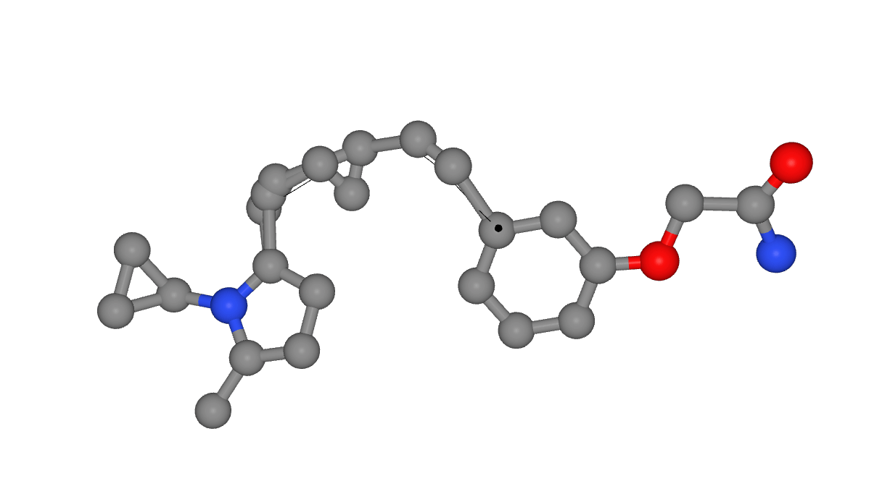

# Similarity based Molecular Generation (SiMGen)

<a href="https://zndraw.icp.uni-stuttgart.de">
    
</a>

SiMGen is a local similarity based molecular generation method. It uses a pretrained MACE model to generate local molecular descriptors and a time-dependent similarity kernel to generate new molecules.

SiMGen is available as an online web-tool at [https://zndraw.icp.uni-stuttgart.de/](https://zndraw.icp.uni-stuttgart.de/).

## Installation

The package can be installed using `pip`:

```sh
pip install simgen
```

Note that the analysis code requires the [rdkit](https://github.com/rdkit/rdkit) package, which is not installed by default. To install it, run

```sh
pip install simgen[all]
```

## Usage

There are two main ways to use the package: via a command line interface or interactively using [ZnDraw](https://github.com/zincware/ZnDraw/).

### Interactive use

We host an online gpu-powered web-tool at [https://zndraw.icp.uni-stuttgart.de/](https://zndraw.icp.uni-stuttgart.de/). The documentation for the web-tool is available [here](https://RokasEl.github.io/simgen/).

However, you can also run ZnDraw locally. After installing the package, you can run the following command to start the web-tool:

```sh
zndraw --port 1234 PATH_TO_XYZ_FILE # Path is optional; Use --no-browser for remote servers
# Do the next command in a separate terminal
simgen connect --device cuda # default port is 1234
```

If you want to try out linker generation, add the `--add-linkers` flag to the `simgen connect` command.

Run `simgen connect --help` for more information.

> [!TIP]
> SiMGen uses the [`mace-models`](https://github.com/RokasEl/MACE-Models) package to download data and the hydrogenation model. Downloading local copies can speed up your workflow. To do so, run
> ```sh
> git clone https://github.com/RokasEl/MACE-Models
> cd MACE-Models
> dvc pull
> simgen init . # or simgen init /path/to/MACE-Models
> ```
> This will set SiMGen's default path to the local MACE models.


### CLI use

For unconstrained generation, you can use the following command:

```sh
python scripts/generate_mols_cli.py --save-path PATH_TO_SAVE_MOLS \
    --num-molecules 10 \
    --num-heavy-atoms 9 \
    --track-trajectories \
    --prior-gaussian-covariance 1. 1. 0.1 # controls the shape of the prior
```

To construct molecules with more complicated shapes, you will have to manually define the shape via a point cloud prior. See `scripts/paper_examples/generate_macrocycles.py` for an example.

## References

If you use SiMGen in your research, please cite the following paper:

```bibtex
```


## License

The code is licensed under the MIT license. See [`LICENSE`](./LICENSE) for more information.
